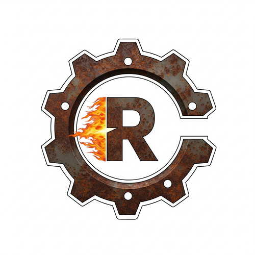

# My learning notes about Rust

Quick actions:

0. Install and Use nightly:

```
rustup toolchain install nightly
rustup default nightly
```

1. Use stable:

```
rustup default stable
```

2. Install and Use nightly `rustfmt`:

```
rustup component add rustfmt --toolchain nightly
cargo +nightly fmt
```

3. Install and Use nightly `clippy`:

```
rustup component add clippy --toolchain nightly
cargo +nightly clippy -- -W clippy::pedantic
```
